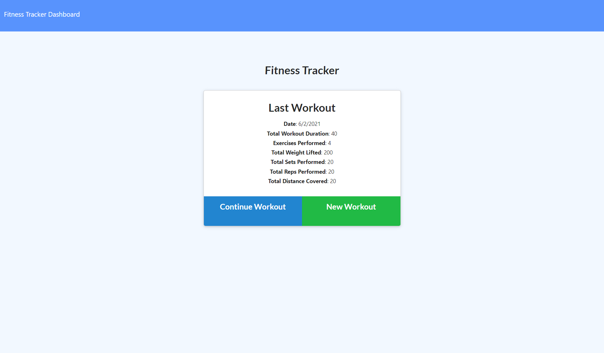

[](https://opensource.org/licenses/MIT)

# Workout-Tracker

## Table of Contents
- [Description](#Description)
- [Deployed Link](#Deployed-Link)
- [Installation](#Installation)
- [Questions](#Questions)
- [Demo](#Demo)
- [Made With](#Made-With)
   
## Description
This is a workout tracker application which is deployed with MongoDB Atlas and Heroku. The user is able to add exercises to the most recent workout plan, add new exercises to a new workout plan, view the combined weight of multiple exercises from the past seven workouts on the `stats` page, and view the total duration of each workout from the past seven workouts on the `stats` page.


## Deployed Link
Heroku Link: https://infinite-fortress-73782.herokuapp.com/


## Installations
Before installing locally, please have Node.js, MongoDB, and npm installed on your computer. Then clone the repo. Install the dependencies by opening the integrated terminal in your root termainal and entering: 
```
npm i 
```
Run the seed that is located in seeds/seeds.js:
```
npm run seed
```
Then connect to the server:
```
npm start 
or
node server.js
```


## Questions
✉️ Contact me with any questions: 

-[Taylor email](mailto:tjl2125@alum.barnard.edu) , [GitHub](https://github.com/tjl2125/) 

### Demo


Copyright (c) [2021] [Taylor Leong]

[MIT License](https://opensource.org/licenses/MIT)
